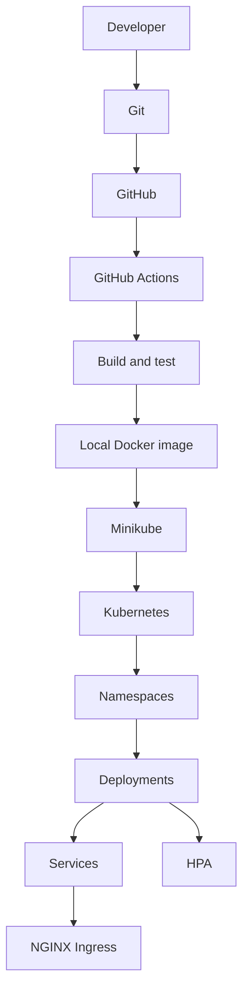
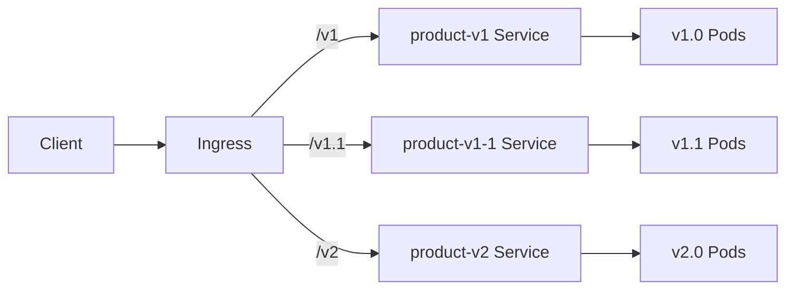

# System Design

## Delivery flow

GitHub Actions validates the application and builds a Docker image on its ephemeral runner. It does not push an image or claim access to the developer's local Minikube cluster. The Windows developer loads release images into Minikube manually.

## Runtime routing

Each Ingress object is deployed in the same namespace as its backend Service. This avoids invalid cross-namespace Service references while allowing the NGINX controller to merge the path rules.

## Resource and scaling policy

Each Deployment starts with two replicas and reserves 100m CPU plus 256Mi memory per replica. Limits are 500m CPU and 512Mi memory. The HPA watches average CPU utilization at 70% and scales between two and five replicas. Metrics Server supplies CPU measurements in Minikube.

## Version policy

The API is additive across releases. v1.0 provides health and listing, v1.1 adds keyword search, and v2 adds pagination and validation. Release tags point to the exact application state used to build each local image.
